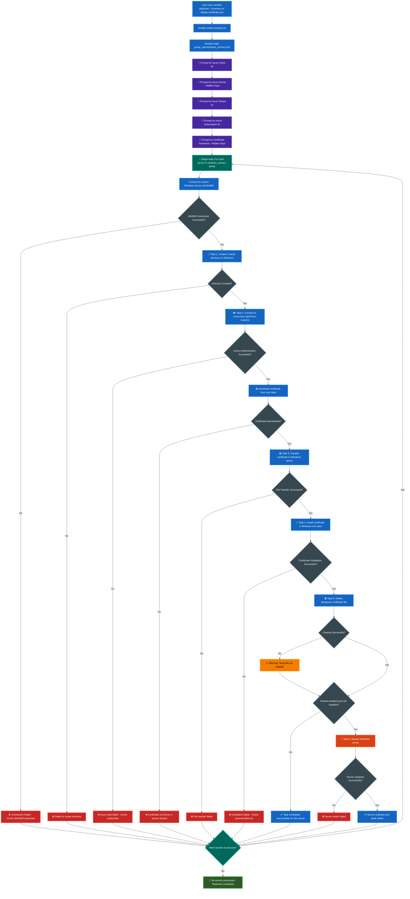

<div align="center">
  
  
  # Ansible Certificate Deployment
  
  **Automated deployment of PFX certificates from Azure Key Vault to Windows servers using Ansible.**
</div>

## 📋 Table of Contents

- [What This Does](#-what-this-does)
- [Key Features](#-key-features)
- [Architecture](#️-architecture)
- [Process Flow](#-process-flow)
- [Quick Start](#-quick-start)
  - [Prerequisites](#1-prerequisites)
  - [Setup Azure](#2-setup-azure)
  - [Configure Repository](#3-configure-repository)
  - [Run the Playbook](#4-run-the-playbook)
- [Repository Structure](#-repository-structure)
- [Configuration Options](#️-configuration-options)
- [Security Features](#-security-features)
- [Troubleshooting](#-troubleshooting)
- [Contributing](#-contributing)
- [Requirements](#-requirements)
- [Documentation](#-documentation)
- [License](#-license)
- [Acknowledgments](#-acknowledgments)

## 🎯 What This Does

- Downloads certificates from Azure Key Vault
- Securely transfers and installs them on multiple Windows servers
- Handles credentials without logging sensitive data
- Provides comprehensive error handling and cleanup

## ✨ Key Features

- **Secure**: No credentials stored in files or logs (`no_log: true` on all sensitive tasks)
- **Scalable**: Deploy to multiple servers simultaneously
- **Reliable**: Comprehensive error handling and rollback
- **Clean**: Automatic cleanup of temporary files
- **Interactive**: Secure credential prompts with hidden input
- **Idempotent**: Safe to run multiple times

## 🏗️ Architecture

- **Control Node**: CentOS server running Ansible
- **Target Servers**: Windows servers with WinRM enabled
- **Certificate Source**: Azure Key Vault
- **Communication**: Secure WinRM over encrypted channels

## 🔄 Process Flow



## 🚀 Quick Start

### 1. Prerequisites

**On CentOS Control Node:**
```bash
# Install required packages
pip3 install azure-keyvault-secrets azure-identity pywinrm

# Install Ansible collections
ansible-galaxy collection install azure.azcollection
ansible-galaxy collection install ansible.windows
```

**On Windows Target Servers:**
```powershell
# Run as Administrator
winrm quickconfig -y
winrm set winrm/config/service/auth '@{Basic="true"}'
winrm set winrm/config/service '@{AllowUnencrypted="true"}'
winrm set winrm/config/winrs '@{MaxMemoryPerShellMB="1024"}'
```

### 2. Setup Azure

- Create an App Registration in Azure AD
- Grant Key Vault access permissions
- Note: Client ID, Client Secret, Tenant ID, Subscription ID, and Resource Group

### 3. Configure Repository

**Clone and setup:**
```bash
git clone <your-repo-url>
cd ansible-certificate-deployment
```

**Create inventory file:**
```ini
# inventory.ini
[windows_servers]
web-server-01 ansible_host=192.168.1.100 ansible_user=Administrator ansible_password=YourPassword
web-server-02 ansible_host=192.168.1.101 ansible_user=Administrator ansible_password=YourPassword

[windows_servers:vars]
ansible_connection=winrm
ansible_winrm_transport=basic
ansible_winrm_server_cert_validation=ignore
```

**Configure group variables:**
```yaml
# group_vars/windows_servers.yml
key_vault_name: "your-keyvault-name"
certificate_name: "your-certificate-name"
azure_resource_group: "your-resource-group"
azure_subscription_id: "your-subscription-id"
cert_store_name: "My"
cert_store_location: "LocalMachine"
restart_after_install: false
restart_timeout: 600
temp_cert_path: "C:\\temp\\certificate.pfx"
```

### 4. Run the Playbook

```bash
# Test connectivity first
ansible windows_servers -i inventory.ini -m win_ping

# Deploy certificates
ansible-playbook -i inventory.ini deploy-certificate.yml
```

**You'll be prompted for:**
- Azure Client ID
- Azure Client Secret (hidden)
- Azure Tenant ID
- Azure Subscription ID
- Certificate Password (hidden)

## 📁 Repository Structure

```
ansible-certificate-deployment/
├── README.md                      # This file
├── LICENSE                        # MIT License
├── deploy-certificate.yml         # Main playbook
├── inventory.ini                  # Server inventory (create this)
├── group_vars/
│   └── windows_servers.yml       # Group variables (create this)
├── docs/
│   ├── troubleshooting.md        # Common issues and solutions
│   └── security-considerations.md # Security best practices
└── examples/
    ├── inventory.ini.example     # Example inventory file
    └── group_vars.yml.example    # Example group variables
```

## ⚙️ Configuration Options

### Certificate Store Locations

| Store Name | Description | Location |
|------------|-------------|----------|
| `My` | Personal certificates | Current User or Local Machine |
| `Root` | Trusted Root CAs | Local Machine |
| `CA` | Intermediate CAs | Local Machine |
| `Trust` | Enterprise Trust | Local Machine |

### Common Variables

```yaml
# group_vars/windows_servers.yml
key_vault_name: "prod-certificates"           # Your Key Vault name
certificate_name: "wildcard-ssl-cert"         # Certificate name in Key Vault
azure_resource_group: "rg-certificates"       # Resource group containing Key Vault
azure_subscription_id: "12345678-1234-1234-1234-123456789012"  # Azure subscription ID
cert_store_name: "My"                         # Certificate store
cert_store_location: "LocalMachine"           # Store location
restart_after_install: false                  # Restart after installation
restart_timeout: 600                          # Restart timeout in seconds
temp_cert_path: "C:\\temp\\certificate.pfx"   # Temporary file path
```

## 🔒 Security Features

- **No credential storage**: All sensitive data prompted at runtime
- **Hidden input**: Passwords and secrets not displayed
- **No logging**: `no_log: true` prevents sensitive data in logs
- **Temporary files**: Automatic cleanup after installation
- **Encrypted transport**: WinRM over HTTPS (recommended)

## 🐛 Troubleshooting

### Common Issues

**WinRM Connection Failed:**
```bash
# Check WinRM configuration
winrm get winrm/config/service
```

**Azure Authentication Failed:**
- Verify App Registration permissions
- Check Client ID, Secret, and Tenant ID
- Ensure Key Vault access policies are set

**Certificate Installation Failed:**
- Verify PFX password
- Check certificate format
- Ensure sufficient permissions

### Debug Mode

```bash
# Run with verbose output
ansible-playbook -i inventory.ini deploy-certificate.yml -vvv
```

## 🤝 Contributing

1. Fork the repository
2. Create a feature branch (`git checkout -b feature/amazing-feature`)
3. Commit your changes (`git commit -m 'Add amazing feature'`)
4. Push to the branch (`git push origin feature/amazing-feature`)
5. Open a Pull Request

## 📋 Requirements

### Control Node (CentOS)
- Ansible 2.9+
- Python 3.6+
- Azure SDK for Python
- pywinrm

### Target Servers (Windows)
- Windows Server 2012+
- WinRM enabled
- PowerShell 3.0+
- Network connectivity to control node

### Azure
- Azure Key Vault with certificates
- App Registration with Key Vault permissions
- Valid Azure subscription

## 📖 Documentation

- [Security Considerations](docs/security-considerations.md)
- [Troubleshooting Guide](docs/troubleshooting.md)
- [Advanced Configuration](docs/advanced-configuration.md)

## 📄 License

This project is licensed under the MIT License - see the [LICENSE](LICENSE) file for details.

## 🙏 Acknowledgments

- Ansible community for excellent Windows modules
- Azure team for Key Vault integration
- Contributors and users of this project

## 📧 Support

- Create an [Issue](../../issues) for bug reports
- Start a [Discussion](../../discussions) for questions
- Check [existing issues](../../issues?q=is%3Aissue) before creating new ones

---

**⭐ If this project helped you, please give it a star!**
