<div align="center">
  
  
  # Ansible Certificate Deployment
  
  **Automated deployment of PFX certificates from Azure Key Vault to Windows servers using Ansible.**
</div>

## 📋 Table of Contents

- [What This Does](#-what-this-does)
- [Key Features](#-key-features)
- [Architecture](#️-architecture)
- [Process Flow](#-process-flow)
- [Quick Start](#-quick-start)
  - [Prerequisites](#1-prerequisites)
  - [Setup Azure](#2-setup-azure)
  - [Configure Repository](#3-configure-repository)
  - [Run the Playbook](#4-run-the-playbook)
- [Repository Structure](#-repository-structure)
- [Configuration Options](#️-configuration-options)
- [Security Features](#-security-features)
- [Troubleshooting](#-troubleshooting)
- [Contributing](#-contributing)
- [Requirements](#-requirements)
- [Documentation](#-documentation)
- [License](#-license)
- [Acknowledgments](#-acknowledgments)

## 🎯 What This Does

- Downloads certificates from Azure Key Vault
- Securely transfers and installs them on multiple Windows servers
- Handles credentials without logging sensitive data
- Provides comprehensive error handling and cleanup

## ✨ Key Features

- **Secure**: No credentials stored in files or logs (`no_log: true` on all sensitive tasks)
- **Scalable**: Deploy to multiple servers simultaneously
- **Reliable**: Comprehensive error handling and rollback
- **Clean**: Automatic cleanup of temporary files
- **Interactive**: Secure credential prompts with hidden input
- **Idempotent**: Safe to run multiple times

## 📋 Requirements

### Control Node (CentOS or some other Linux distro running Ansible)
- Ansible 2.9+
- Python 3.6+
- Azure CLI 2.0+
- pywinrm package

### Target Servers (Windows)
- Windows Server 2012+
- WinRM enabled and configured
- PowerShell 3.0+
- Network connectivity to control node on port 5985 (HTTP) or 5986 (HTTPS)

### Azure
- Azure Key Vault with certificates stored as secrets
- App Registration with proper role assignments:
  - **Subscription level**: Reader role
  - **Key Vault level**: Key Vault Secrets User role
- Valid Azure subscription

## 🏗️ Architecture

- **Control Node**: CentOS server running Ansible
- **Target Servers**: Windows servers with WinRM enabled
- **Certificate Source**: Azure Key Vault
- **Communication**: Secure WinRM over encrypted channels

## 🔄 Process Flow

```mermaid
flowchart TD
    A[User runs: ansible-playbook -i inventory.ini deploy-certificate.yml] --> B[Ansible reads inventory.ini]
    B --> C[Ansible loads group_vars/windows_servers.yml]
    C --> D[🔐 Prompt for Azure Client ID]
    D --> E[🔐 Prompt for Azure Secret - Hidden Input]
    E --> F[🔐 Prompt for Azure Tenant ID]
    F --> G[🔐 Prompt for Azure Subscription ID]
    G --> H[🔐 Prompt for Certificate Password - Hidden Input]
    
    H --> I[🔄 Begin loop: For each server in windows_servers group]
    I --> J[Connect to current Windows server via WinRM]
    
    J --> K{WinRM Connection Successful?}
    K -->|No| L[❌ Connection Failed - Check WinRM/Credentials]
    L --> M{More servers to process?}
    K -->|Yes| N[📁 Task 1: Create C:\temp directory on Windows]
    
    N --> O{Directory Created?}
    O -->|No| P[❌ Failed to create directory]
    P --> M
    O -->|Yes| Q[☁️ Task 2: Connect to Azure Key Vault from CentOS]
    
    Q --> R{Azure Authentication Successful?}
    R -->|No| S[❌ Azure auth failed - Check credentials]
    S --> M
    R -->|Yes| T[📥 Download certificate from Key Vault]
    
    T --> U{Certificate Downloaded?}
    U -->|No| V[❌ Certificate not found or access denied]
    V --> M
    U -->|Yes| W[📤 Task 3: Transfer certificate to Windows server]
    
    W --> X{File Transfer Successful?}
    X -->|No| Y[❌ File transfer failed]
    Y --> M
    X -->|Yes| Z[🔧 Task 4: Install certificate in Windows cert store]
    
    Z --> AA{Certificate Installation Successful?}
    AA -->|No| BB[❌ Installation failed - Check password/format]
    BB --> M
    AA -->|Yes| CC[🗑️ Task 5: Delete temporary certificate file]
    
    CC --> DD{Cleanup Successful?}
    DD -->|No| EE[⚠️ Warning: Temp file not deleted]
    EE --> FF{Restart enabled and cert installed?}
    DD -->|Yes| FF{Restart enabled and cert installed?}
    
    FF -->|No| GG[✅ Task completed successfully for this server]
    FF -->|Yes| HH[🔄 Task 6: Restart Windows server]
    
    HH --> II{Server restarted successfully?}
    II -->|No| JJ[❌ Server restart failed]
    II -->|Yes| KK[✅ Server restarted and back online]
    
    GG --> M
    JJ --> M
    KK --> M
    M -->|Yes| I
    M -->|No| LL[🎉 All servers processed - Playbook completed]
    
    %% High contrast color scheme
    classDef successClass fill:#2d5a27,stroke:#4caf50,stroke-width:3px,color:#ffffff
    classDef errorClass fill:#c62828,stroke:#f44336,stroke-width:3px,color:#ffffff
    classDef warningClass fill:#f57c00,stroke:#ff9800,stroke-width:3px,color:#000000
    classDef processClass fill:#1565c0,stroke:#2196f3,stroke-width:2px,color:#ffffff
    classDef inputClass fill:#4527a0,stroke:#673ab7,stroke-width:3px,color:#ffffff
    classDef loopClass fill:#00695c,stroke:#009688,stroke-width:4px,color:#ffffff
    classDef decisionClass fill:#37474f,stroke:#607d8b,stroke-width:3px,color:#ffffff
    classDef restartClass fill:#d84315,stroke:#ff5722,stroke-width:3px,color:#ffffff
    
    class LL successClass
    class L,P,S,V,Y,BB,JJ errorClass
    class EE warningClass
    class A,B,C,J,N,Q,T,W,Z,CC,GG,KK processClass
    class D,E,F,G,H inputClass
    class I,M loopClass
    class K,O,R,U,X,AA,DD,FF,II decisionClass
    class HH restartClass
```



## 🚀 Quick Start

### 1. Prerequisites

**On CentOS Control Node:**
```bash
# Install required packages
pip3 install azure-cli pywinrm

# Install Ansible collections
ansible-galaxy collection install ansible.windows

# Install Azure CLI (CentOS/RHEL)
sudo rpm --import https://packages.microsoft.com/keys/microsoft.asc
echo -e "[azure-cli]
name=Azure CLI
baseurl=https://packages.microsoft.com/yumrepos/azure-cli
enabled=1
gpgcheck=1
gpgkey=https://packages.microsoft.com/keys/microsoft.asc" | sudo tee /etc/yum.repos.d/azure-cli.repo
sudo yum install -y azure-cli

# Verify installations
ansible --version
az --version
```

**On Windows Target Servers:**
```powershell
# Run as Administrator

# Enables PowerShell remoting (required for WinRM)
Enable-PSRemoting

# Allows Basic authentication for the WinRM service
winrm set winrm/config/service/auth '@{Basic="true"}'

# Allows unencrypted communication (use only in trusted networks)
winrm set winrm/config/service '@{AllowUnencrypted="true"}'

# Increases the maximum memory per remote PowerShell session to 1 GB
winrm set winrm/config/winrs '@{MaxMemoryPerShellMB="1024"}'

# Allows unencrypted communication from the client side
winrm set winrm/config/client '@{AllowUnencrypted="true"}'

# Allows Basic authentication for the WinRM client
winrm set winrm/config/client/auth '@{Basic="true"}'

# Adds all remote systems (*) to the list of trusted hosts
winrm set winrm/config/client '@{TrustedHosts="*"}'

# Enables the firewall rule for WinRM over HTTP
Enable-NetFirewallRule -DisplayName "Windows Remote Management (HTTP-In)"

# Restarts the WinRM service to apply changes
Restart-Service WinRM
```

### 2. Setup Azure

- Create an App Registration in Azure AD
- Grant **subscription-level access** and Key Vault access permissions
- **Required Permissions:**
  - **Subscription level**: `Reader` role
  - **Key Vault level**: `Key Vault Secrets User` role
- Note: Client ID, Client Secret, Tenant ID, and Subscription ID

### 3. Configure Repository

**Clone and setup:**
```bash
git clone <your-repo-url>
cd ansible-certificate-deployment
```

**Create inventory file:**
```ini
# example inventory.ini
[windows_servers]
192.168.0.1 # Put the IPs of your Windows servers 
192.168.0.2
192.168.0.3
```
**Configure main file for playbook variables:**
```yaml
# Main configuration file for Windows servers
# This file includes all vault files and sets up variables

# Windows Connection Settings (using vaulted credentials)
ansible_user: "{{ vault_windows_user }}"
ansible_password: "{{ vault_windows_password }}"
ansible_connection: winrm
ansible_winrm_scheme: http
ansible_winrm_transport: basic
ansible_winrm_server_cert_validation: ignore
ansible_port: 5985

# Azure Key Vault settings (using vaulted credentials)
azure_client_id: "{{ vault_azure_client_id }}"
azure_secret: "{{ vault_azure_secret }}"
azure_tenant: "{{ vault_azure_tenant }}"
azure_subscription: "{{ vault_azure_subscription }}"

# Certificate password (using vaulted password)
certificate_password: "{{ vault_certificate_password }}"

# Azure Key Vault configuration (non-sensitive)
key_vault_name: "YourActualKeyVaultName"
certificate_name: "YourActualCertificateName"

# Windows certificate settings (non-sensitive)
cert_store_name: "My"
cert_store_location: "LocalMachine"

# Server management settings (non-sensitive)
restart_after_install: false
restart_timeout: 600

# Temporary paths (non-sensitive)
temp_cert_path: "C:\\temp\\certificate.pfx"
```

**Configure Vault file for server variables:**
```yaml
# group_vars/windows_servers/vault_windows.yml
vault_windows_user: Administrator
vault_windows_password: YourActualWindowsPassword
```

**Configure Vault file for azure variables:**
```yaml
# group_vars/windows_servers/vault_azure.yml
vault_azure_client_id:
vault_azure_secret:
vault_azure_tenant:
vault_azure_subscription:
```

**Configure Vault file for certificate variables:**
```yaml
# group_vars/windows_servers/windows_servers.yml
vault_certificate_password: # leave blank if no password
```

**Confgure the Password file for your Vaults
```
# ./.vault_pass
YourActualVaultPassword
```
Then run:
```bash
chmod 600 .vault_pass
```

#### Encrypt Your Vault Files
For each variable file, that contains "vault" in the name, run this command to encrypt it.
```bash
ansible-vault encrypt path/to/vault/file/vault_example.yml
```
When you are prompted for the password, put in the same password you put in your .vault_pass file.
Try reading the vault file, you should see it encrypted in AES256.

#### Confirm Vault Content Is Still Valid
```bash
ansible-vault view /path/to/vault/file/vault_example.yml --vault-password-file .vault_pass
```
You should see the content of the vault file before you encrypted them.


### 6. Run the Playbook

```bash
# Test connectivity first
ansible windows_servers -i inventory.ini -m win_ping --vault-password-file .vault_pass

# Deploy certificates using password file
ansible-playbook -i inventory.ini certificate-deployment-windows.yml --vault-password-file .vault_pass
```

**Override restart behavior:**
```bash
# Enable restart for this deployment only
ansible-playbook -i inventory.ini deploy-certificate.yml --vault-password-file .vault_pass -e "restart_after_install=true"
```

## 📁 Repository Structure

```
certificate-deployment-windows/
├── README.md                           # This file
├── LICENSE                             # MIT License
├── certificate-deployment-windows.yml              # Main playbook
├── inventory.ini                       # Server inventory (no credentials)
├── .vault_pass                         # Vault password file (gitignored)
├── .gitignore                          # Excludes sensitive files
├── group_vars/
   └── windows_servers/
       ├── main.yml                    # Main configuration (references vault vars)
       ├── vault_windows.yml           # Windows credentials (encrypted)
       ├── vault_azure.yml             # Azure credentials (encrypted)
       └── vault_certificates.yml      # Certificate passwords (encrypted)
```

## 🐛 Troubleshooting

### Common Issues

**Vault Decryption Failed:**
```bash
# Check if vault password is correct
ansible-vault view group_vars/windows_servers/vault_windows.yml --vault-password-file .vault_pass

# If password is wrong, update .vault_pass file
echo "CorrectVaultPassword" > .vault_pass
chmod 600 .vault_pass
```

**WinRM Connection Failed:**
```bash
# Check WinRM configuration on Windows server
winrm get winrm/config/service

# Verify firewall allows WinRM traffic
netsh advfirewall firewall show rule name="Windows Remote Management (HTTP-In)"

# Test connectivity from control node
ansible windows_servers -i inventory.ini -m win_ping --vault-password-file .vault_pass
```

**Azure Authentication Failed:**
- Verify App Registration has proper permissions:
  - **Subscription**: Reader role
  - **Key Vault**: Key Vault Secrets User role
- Check Client ID, Secret, Tenant ID, and Subscription ID in vault files
- Test Azure CLI login manually:
```bash
# Decrypt and view Azure credentials
ansible-vault view group_vars/windows_servers/vault_azure.yml --vault-password-file .vault_pass

# Test login manually
az login --service-principal -u CLIENT_ID -p CLIENT_SECRET --tenant TENANT_ID
```

**"No subscriptions found" Error:**
- Service Principal needs Reader role at subscription level
- Grant access via Azure Portal → Subscriptions → Access control (IAM)

**Certificate Installation Failed:**
- Verify PFX password is correct in vault_certificates.yml
- Check certificate format and validity
- Ensure Windows user has sufficient permissions
- Check certificate store permissions

**Variables Not Loading:**
```bash
# Check if vault files are properly referenced
ansible-inventory -i inventory.ini --list --vault-password-file .vault_pass

# Verify main.yml references vault variables correctly
ansible-vault view group_vars/windows_servers/main.yml --vault-password-file .vault_pass
```

### Debug Mode

```bash
# Run with verbose output to troubleshoot issues
ansible-playbook -i inventory.ini deploy-certificate.yml --vault-password-file .vault_pass -v

# Even more verbose for detailed debugging
ansible-playbook -i inventory.ini deploy-certificate.yml --vault-password-file .vault_pass -vvv

# Check variable loading
ansible-inventory -i inventory.ini --list --vault-password-file .vault_pass
```

## 📄 License

This project is licensed under the MIT License - see the [LICENSE](LICENSE) file for details.

---

**⭐ If this project helped you, please give it a star!**
