<div align="center">
  
  
  # Ansible Certificate Deployment
  
  **Automated deployment of PFX certificates from Azure Key Vault to Windows servers using Ansible.**
</div>

## 📋 Table of Contents

- [What This Does](#-what-this-does)
- [Key Features](#-key-features)
- [Architecture](#️-architecture)
- [Process Flow](#-process-flow)
- [Quick Start](#-quick-start)
  - [Prerequisites](#1-prerequisites)
  - [Setup Azure](#2-setup-azure)
  - [Configure Repository](#3-configure-repository)
  - [Run the Playbook](#4-run-the-playbook)
- [Repository Structure](#-repository-structure)
- [Configuration Options](#️-configuration-options)
- [Security Features](#-security-features)
- [Troubleshooting](#-troubleshooting)
- [Contributing](#-contributing)
- [Requirements](#-requirements)
- [Documentation](#-documentation)
- [License](#-license)
- [Acknowledgments](#-acknowledgments)

## 🎯 What This Does

- Downloads certificates from Azure Key Vault
- Securely transfers and installs them on multiple Windows servers
- Handles credentials without logging sensitive data
- Provides comprehensive error handling and cleanup

## ✨ Key Features

- **Secure**: No credentials stored in files or logs (`no_log: true` on all sensitive tasks)
- **Scalable**: Deploy to multiple servers simultaneously
- **Reliable**: Comprehensive error handling and rollback
- **Clean**: Automatic cleanup of temporary files
- **Interactive**: Secure credential prompts with hidden input
- **Idempotent**: Safe to run multiple times

## 🏗️ Architecture

- **Control Node**: CentOS server running Ansible
- **Target Servers**: Windows servers with WinRM enabled
- **Certificate Source**: Azure Key Vault
- **Communication**: Secure WinRM over encrypted channels

## 🔄 Process Flow

```mermaid
flowchart TD
    A[User runs: ansible-playbook -i inventory.ini deploy-certificate.yml] --> B[Ansible reads inventory.ini]
    B --> C[Ansible loads group_vars/windows_servers.yml]
    C --> D[🔐 Prompt for Azure Client ID]
    D --> E[🔐 Prompt for Azure Secret - Hidden Input]
    E --> F[🔐 Prompt for Azure Tenant ID]
    F --> G[🔐 Prompt for Azure Subscription ID]
    G --> H[🔐 Prompt for Certificate Password - Hidden Input]
    
    H --> I[🔄 Begin loop: For each server in windows_servers group]
    I --> J[Connect to current Windows server via WinRM]
    
    J --> K{WinRM Connection Successful?}
    K -->|No| L[❌ Connection Failed - Check WinRM/Credentials]
    L --> M{More servers to process?}
    K -->|Yes| N[📁 Task 1: Create C:\temp directory on Windows]
    
    N --> O{Directory Created?}
    O -->|No| P[❌ Failed to create directory]
    P --> M
    O -->|Yes| Q[☁️ Task 2: Connect to Azure Key Vault from CentOS]
    
    Q --> R{Azure Authentication Successful?}
    R -->|No| S[❌ Azure auth failed - Check credentials]
    S --> M
    R -->|Yes| T[📥 Download certificate from Key Vault]
    
    T --> U{Certificate Downloaded?}
    U -->|No| V[❌ Certificate not found or access denied]
    V --> M
    U -->|Yes| W[📤 Task 3: Transfer certificate to Windows server]
    
    W --> X{File Transfer Successful?}
    X -->|No| Y[❌ File transfer failed]
    Y --> M
    X -->|Yes| Z[🔧 Task 4: Install certificate in Windows cert store]
    
    Z --> AA{Certificate Installation Successful?}
    AA -->|No| BB[❌ Installation failed - Check password/format]
    BB --> M
    AA -->|Yes| CC[🗑️ Task 5: Delete temporary certificate file]
    
    CC --> DD{Cleanup Successful?}
    DD -->|No| EE[⚠️ Warning: Temp file not deleted]
    EE --> FF{Restart enabled and cert installed?}
    DD -->|Yes| FF{Restart enabled and cert installed?}
    
    FF -->|No| GG[✅ Task completed successfully for this server]
    FF -->|Yes| HH[🔄 Task 6: Restart Windows server]
    
    HH --> II{Server restarted successfully?}
    II -->|No| JJ[❌ Server restart failed]
    II -->|Yes| KK[✅ Server restarted and back online]
    
    GG --> M
    JJ --> M
    KK --> M
    M -->|Yes| I
    M -->|No| LL[🎉 All servers processed - Playbook completed]
    
    %% High contrast color scheme
    classDef successClass fill:#2d5a27,stroke:#4caf50,stroke-width:3px,color:#ffffff
    classDef errorClass fill:#c62828,stroke:#f44336,stroke-width:3px,color:#ffffff
    classDef warningClass fill:#f57c00,stroke:#ff9800,stroke-width:3px,color:#000000
    classDef processClass fill:#1565c0,stroke:#2196f3,stroke-width:2px,color:#ffffff
    classDef inputClass fill:#4527a0,stroke:#673ab7,stroke-width:3px,color:#ffffff
    classDef loopClass fill:#00695c,stroke:#009688,stroke-width:4px,color:#ffffff
    classDef decisionClass fill:#37474f,stroke:#607d8b,stroke-width:3px,color:#ffffff
    classDef restartClass fill:#d84315,stroke:#ff5722,stroke-width:3px,color:#ffffff
    
    class LL successClass
    class L,P,S,V,Y,BB,JJ errorClass
    class EE warningClass
    class A,B,C,J,N,Q,T,W,Z,CC,GG,KK processClass
    class D,E,F,G,H inputClass
    class I,M loopClass
    class K,O,R,U,X,AA,DD,FF,II decisionClass
    class HH restartClass
```



## 🚀 Quick Start

### 1. Prerequisites

**On CentOS Control Node:**
```bash
# Install required packages
pip3 install azure-cli pywinrm

# Install Ansible collections
ansible-galaxy collection install ansible.windows

# Install Azure CLI (CentOS/RHEL)
sudo rpm --import https://packages.microsoft.com/keys/microsoft.asc
echo -e "[azure-cli]
name=Azure CLI
baseurl=https://packages.microsoft.com/yumrepos/azure-cli
enabled=1
gpgcheck=1
gpgkey=https://packages.microsoft.com/keys/microsoft.asc" | sudo tee /etc/yum.repos.d/azure-cli.repo
sudo yum install -y azure-cli

# Verify installations
ansible --version
az --version
```

**On Windows Target Servers:**
```powershell
# Run as Administrator
winrm quickconfig -y
winrm set winrm/config/service/auth '@{Basic="true"}'
winrm set winrm/config/service '@{AllowUnencrypted="true"}'
winrm set winrm/config/winrs '@{MaxMemoryPerShellMB="1024"}'
```

### 2. Setup Azure

- Create an App Registration in Azure AD
- Grant **subscription-level access** and Key Vault access permissions
- **Required Permissions:**
  - **Subscription level**: `Reader` role
  - **Key Vault level**: `Key Vault Secrets User` role
- Note: Client ID, Client Secret, Tenant ID, and Subscription ID

**Grant permissions using Azure CLI:**
```bash
# Assign Reader role at subscription level
az role assignment create \
    --assignee "your-client-id" \
    --role "Reader" \
    --scope "/subscriptions/your-subscription-id"

# Assign Key Vault access
az role assignment create \
    --assignee "your-client-id" \
    --role "Key Vault Secrets User" \
    --scope "/subscriptions/your-subscription-id/resourceGroups/your-rg/providers/Microsoft.KeyVault/vaults/your-keyvault"
```

### 3. Configure Repository

**Clone and setup:**
```bash
git clone <your-repo-url>
cd ansible-certificate-deployment
```

**Create inventory file:**
```ini
# inventory.ini
[windows_servers]
web-server-01 ansible_host=192.168.1.100 ansible_user=Administrator ansible_password=YourPassword
web-server-02 ansible_host=192.168.1.101 ansible_user=Administrator ansible_password=YourPassword

[windows_servers:vars]
ansible_connection=winrm
ansible_winrm_transport=basic
ansible_winrm_server_cert_validation=ignore
```

**Configure group variables:**
```yaml
# group_vars/windows_servers.yml
key_vault_name: "your-keyvault-name"
certificate_name: "your-certificate-name"
azure_resource_group: "your-resource-group"
azure_subscription_id: "your-subscription-id"
cert_store_name: "My"
cert_store_location: "LocalMachine"
restart_after_install: false
restart_timeout: 600
temp_cert_path: "C:\\temp\\certificate.pfx"
```

### 6. Run the Playbook

```bash
# Test connectivity first
ansible windows_servers -i inventory.ini -m win_ping --vault-password-file .vault_pass

# Deploy certificates using password file
ansible-playbook -i inventory.ini deploy-certificate.yml --vault-password-file .vault_pass

# Or use interactive password prompt
ansible-playbook -i inventory.ini deploy-certificate.yml --ask-vault-pass
```

**Override restart behavior:**
```bash
# Enable restart for this deployment only
ansible-playbook -i inventory.ini deploy-certificate.yml --vault-password-file .vault_pass -e "restart_after_install=true"

# Use different certificate
ansible-playbook -i inventory.ini deploy-certificate.yml --vault-password-file .vault_pass -e "certificate_name=prod-cert"
```

## 📁 Repository Structure

## 📁 Repository Structure

```
ansible-certificate-deployment/
├── README.md                           # This file
├── LICENSE                             # MIT License
├── deploy-certificate.yml              # Main playbook
├── inventory.ini                       # Server inventory (no credentials)
├── .vault_pass                         # Vault password file (gitignored)
├── .gitignore                          # Excludes sensitive files
├── group_vars/
│   └── windows_servers/
│       ├── main.yml                    # Main configuration (references vault vars)
│       ├── vault_windows.yml           # Windows credentials (encrypted)
│       ├── vault_azure.yml             # Azure credentials (encrypted)
│       └── vault_certificates.yml      # Certificate passwords (encrypted)
├── docs/
│   ├── troubleshooting.md             # Common issues and solutions
│   └── security-considerations.md      # Security best practices
└── examples/
    ├── inventory.ini.example          # Example inventory file
    └── group_vars.yml.example         # Example group variables
```

## ⚙️ Configuration Options

### Certificate Store Locations

| Store Name | Description | Location |
|------------|-------------|----------|
| `My` | Personal certificates | Current User or Local Machine |
| `Root` | Trusted Root CAs | Local Machine |
| `CA` | Intermediate CAs | Local Machine |
| `Trust` | Enterprise Trust | Local Machine |

### Common Variables

```yaml
## ⚙️ Configuration Options

### Vault Management

**View encrypted vault contents:**
```bash
ansible-vault view group_vars/windows_servers/vault_windows.yml --vault-password-file .vault_pass
```

**Edit encrypted vault files:**
```bash
ansible-vault edit group_vars/windows_servers/vault_azure.yml --vault-password-file .vault_pass
```

**Encrypt existing plain text files:**
```bash
ansible-vault encrypt group_vars/windows_servers/plain_file.yml
```

**Change vault password:**
```bash
ansible-vault rekey group_vars/windows_servers/vault_*.yml
```

### Certificate Store Locations

| Store Name | Description | Location |
|------------|-------------|----------|
| `My` | Personal certificates | Current User or Local Machine |
| `Root` | Trusted Root CAs | Local Machine |
| `CA` | Intermediate CAs | Local Machine |
| `Trust` | Enterprise Trust | Local Machine |

### Configuration Variables

**Main configuration variables (non-sensitive):**
```yaml
# group_vars/windows_servers/main.yml
key_vault_name: "prod-certificates"           # Your Key Vault name
certificate_name: "wildcard-ssl-cert"         # Certificate name in Key Vault
cert_store_name: "My"                         # Certificate store
cert_store_location: "LocalMachine"           # Store location
restart_after_install: false                  # Restart after installation
restart_timeout: 600                          # Restart timeout in seconds
temp_cert_path: "C:\\temp\\certificate.pfx"   # Temporary file path
```

**Vaulted credentials (encrypted):**
- `vault_windows_user` and `vault_windows_password` (Windows authentication)
- `vault_azure_client_id`, `vault_azure_secret`, `vault_azure_tenant`, `vault_azure_subscription` (Azure authentication)
- `vault_certificate_password` (Certificate decryption)
```

## 🔒 Security Features

- **Encrypted credentials**: All sensitive data stored in Ansible Vault files
- **No plain text secrets**: Zero credentials visible in repository files
- **Secure transfer**: WinRM handles encrypted data transfer
- **Temporary files**: Automatic cleanup after installation
- **Group-level management**: Consistent configuration across all servers
- **Azure CLI integration**: Uses Microsoft's recommended authentication method
- **Git-safe**: Repository can be safely committed with encrypted vault files

## 🐛 Troubleshooting

### Common Issues

**Vault Decryption Failed:**
```bash
# Check if vault password is correct
ansible-vault view group_vars/windows_servers/vault_windows.yml --vault-password-file .vault_pass

# If password is wrong, update .vault_pass file
echo "CorrectVaultPassword" > .vault_pass
chmod 600 .vault_pass
```

**WinRM Connection Failed:**
```bash
# Check WinRM configuration on Windows server
winrm get winrm/config/service

# Verify firewall allows WinRM traffic
netsh advfirewall firewall show rule name="Windows Remote Management (HTTP-In)"

# Test connectivity from control node
ansible windows_servers -i inventory.ini -m win_ping --vault-password-file .vault_pass
```

**Azure Authentication Failed:**
- Verify App Registration has proper permissions:
  - **Subscription**: Reader role
  - **Key Vault**: Key Vault Secrets User role
- Check Client ID, Secret, Tenant ID, and Subscription ID in vault files
- Test Azure CLI login manually:
```bash
# Decrypt and view Azure credentials
ansible-vault view group_vars/windows_servers/vault_azure.yml --vault-password-file .vault_pass

# Test login manually
az login --service-principal -u CLIENT_ID -p CLIENT_SECRET --tenant TENANT_ID
```

**"No subscriptions found" Error:**
- Service Principal needs Reader role at subscription level
- Grant access via Azure Portal → Subscriptions → Access control (IAM)

**Certificate Installation Failed:**
- Verify PFX password is correct in vault_certificates.yml
- Check certificate format and validity
- Ensure Windows user has sufficient permissions
- Check certificate store permissions

**Variables Not Loading:**
```bash
# Check if vault files are properly referenced
ansible-inventory -i inventory.ini --list --vault-password-file .vault_pass

# Verify main.yml references vault variables correctly
ansible-vault view group_vars/windows_servers/main.yml --vault-password-file .vault_pass
```

### Debug Mode

```bash
# Run with verbose output to troubleshoot issues
ansible-playbook -i inventory.ini deploy-certificate.yml --vault-password-file .vault_pass -v

# Even more verbose for detailed debugging
ansible-playbook -i inventory.ini deploy-certificate.yml --vault-password-file .vault_pass -vvv

# Check variable loading
ansible-inventory -i inventory.ini --list --vault-password-file .vault_pass
```

## 🤝 Contributing

1. Fork the repository
2. Create a feature branch (`git checkout -b feature/amazing-feature`)
3. Commit your changes (`git commit -m 'Add amazing feature'`)
4. Push to the branch (`git push origin feature/amazing-feature`)
5. Open a Pull Request

## 📋 Requirements

### Control Node (CentOS)
- Ansible 2.9+
- Python 3.6+
- Azure CLI 2.0+
- pywinrm package

### Target Servers (Windows)
- Windows Server 2012+
- WinRM enabled and configured
- PowerShell 3.0+
- Network connectivity to control node on port 5985 (HTTP) or 5986 (HTTPS)

### Azure
- Azure Key Vault with certificates stored as secrets
- App Registration with proper role assignments:
  - **Subscription level**: Reader role
  - **Key Vault level**: Key Vault Secrets User role
- Valid Azure subscription

## 📖 Documentation

- [Troubleshooting Guide](docs/troubleshooting.md)
- [Security Considerations](docs/security-considerations.md)
- [WinRM Configuration Guide](docs/winrm-setup.md)
- [Azure Service Principal Setup](docs/azure-setup.md)

## 📄 License

This project is licensed under the MIT License - see the [LICENSE](LICENSE) file for details.

## 🙏 Acknowledgments

- Ansible community for excellent Windows modules
- Azure team for Key Vault integration
- Contributors and users of this project

## 📧 Support

- Create an [Issue](../../issues) for bug reports
- Start a [Discussion](../../discussions) for questions
- Check [existing issues](../../issues?q=is%3Aissue) before creating new ones

---

**⭐ If this project helped you, please give it a star!**
